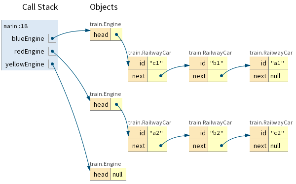

# Linked Lists

Linda Seiter

---

## Why do students struggle with linked lists?

- Composition (LinkedList + Node) **and** Self-Referential (Node)
- Object traversal, null reference, reference reassignment, circular reference
- Abstract software object, not a "real world" object

---

## Composition Warmup Lesson

_Where to store the relationship?_

One-to-many:

- Book -< Review
- Order -< Item

Many-to-many:

- Publisher -< Book -< Review
- Customer -< Order -< Item

Object Traversal (code/debug activities):

- Total cost of items in order 123.
- All book reviews for publisher Z?
- Which customers purchased item J?

---

## Self-Referential Warmup Lesson

Self-Referential Class:

- A person has a best friend
- A person has an oldest sibling
- A course has prerequisite(s)

Object Traversal, Reference Reassignment (code/debug activities):

- Best friend’s best friend? Is X a prereq of Y? Oldest sibling’s best friend?
- Circular references (ok with friends, not ok with prereqs)
- Oldest sibling has new best friend, Dump best friend

---

## Real World Composition + Self-Referential Warmup Lesson

Train: 1 engine pulling N railway cars

## 
