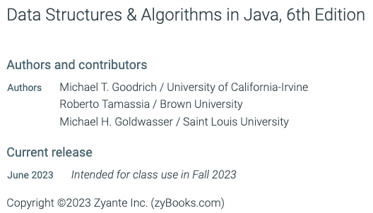

# Linked Lists

Linda Seiter

---

## Why are linked lists so challenging to learn?

- Composition (LinkedList + Node) **and** Self-Referential (Node)
- Object traversal, null reference, circular reference
- Reference reassignment
- Abstract software object, not a "real world" object

_Have students had sufficient practice with these concepts?_

---

## Composition Warmup Lesson

_Where to store the relationship?_

One-to-many:

- Book -< Review
- Order -< Item

Many-to-many:

- Publisher -< Book -< Review
- Customer -< Order -< Item

Object Traversal (code/debug activities):

- Total cost of items in order 123.
- All book reviews for publisher Z?
- Which customers purchased item J?

---

## Self-Referential Warmup Lesson

Self-Referential Class:

- A person has a best friend
- A person has an oldest sibling
- A course has prerequisite(s)

Object Traversal, Reference Reassignment (code/debug activities):

- Best friend’s best friend? Is X a prereq of Y? Oldest sibling’s best friend?
- Circular references (ok with friends, not ok with prereqs)
- Oldest sibling has new best friend, Dump best friend

---

## Real World Composition + Self-Referential Warmup

Train engine pulling railway cars

```java
public class RailwayCar {
    private String id;
    private RailwayCar next;

    ...
}

public class Engine {

    private RailwayCar head;

    public void addToFront(RailwayCar car) {
        ...
    }

    public void addToEnd(RailwayCar car) {
        ...
    }

    public void detach(String id) {
        ...
    }
}
```

## 

---

## Debugging to help students understand object references

- Visual debugger

- Builtin IDE debugger

---

## Linked List Warmup Assessment

- Worksheet: Object state <-> Code
- Coding Task: Update RailwayCar to store passenger class. Update Engine
  addTo..() methods to maintain class order:1st class cars, 2nd class cars, etc.
- Coding Task: Add a splice method that takes 2 car ids and removes that section
  of the train
- Coding Task: Update RailwayCar with field for weight. Update the Engine class
  with a field for maximum weight it can pull. Update Engine methods to prevent
  too heavy a load.

---

## Teaching Linked Lists

I've used Zybooks for some of my intro programming courses.

- Participation Activities (formative throughout lesson)
- Challenge Activities (summative per lesson)



---

## How I would tweak the lessons:

- **Non-Generics Singly Linked List (int or String)**
- Generics SLL
- Circular SLL
- **Circular SLL without explicit size field**
- **DLL without sentinels**
- DLL with sentinels
- Cloning linked lists, shallow vs deep copying

---

## Assignment with 4-5 tasks

Some possibilities:

- Find the middle node of DLL
- Merge two linked lists
- Swap two nodes x and y (and not just their contents) in SLL given their
  references. Repeat for a DLL. Analyze the efficiency of each. Which algorithm
  takes more time?
- Given a circularly linked list containing an even number of nodes, implement a
  method two split into two circularly linked lists of half the size.
- Implement the DLL with a single sentinel that guards both ends.
- Implement a circular version of a doubly linked list, without any sentinels,
  that supports all the public behaviors of the original as well as two new
  update methods, rotate() and rotateBackward().
